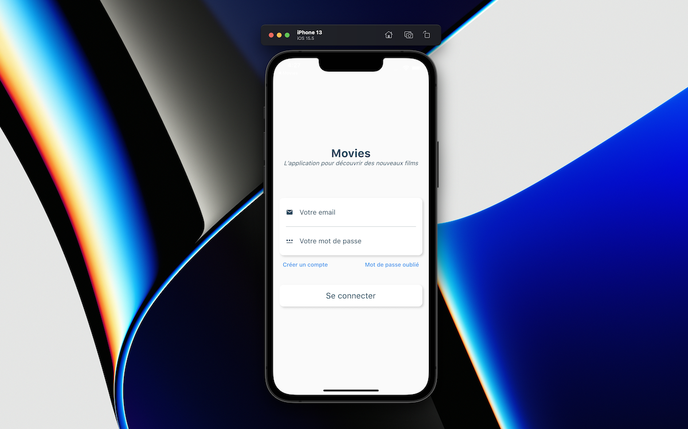
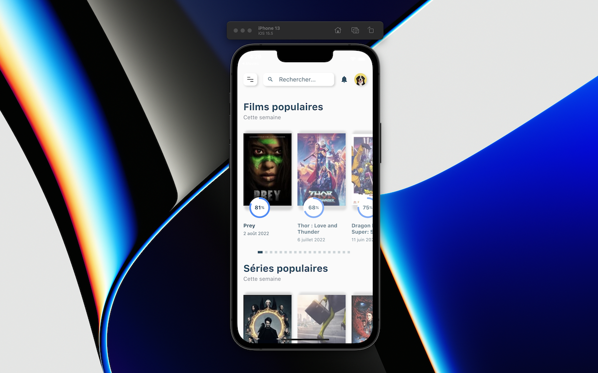
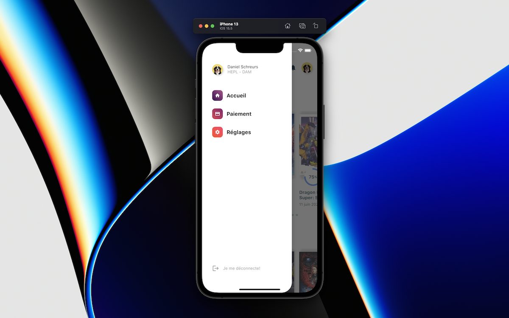
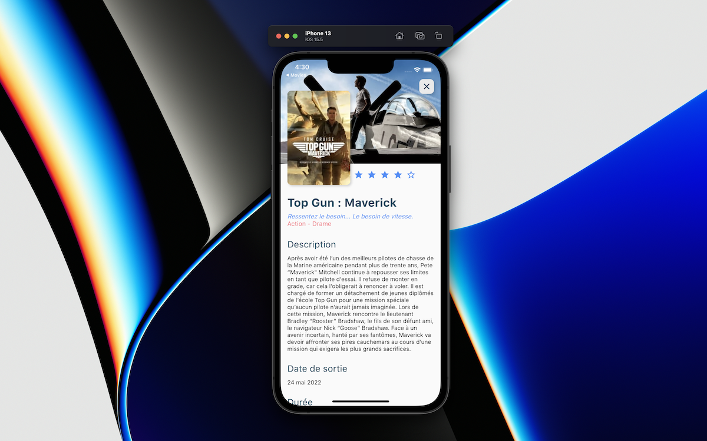
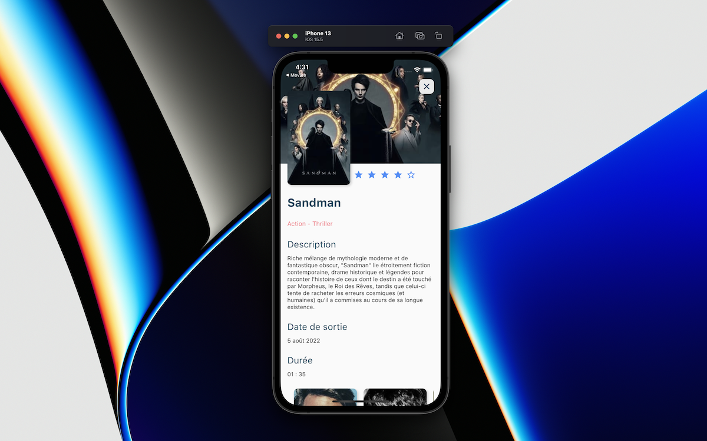

# Movies
>Année scolaire : 2022-2023
>
>Il s'agit ici d'un projet scolaire réalisé dans le cadre du cours de *[Développement d’Applications Mobiles](https://github.com/hepl-dam)* à la Haute École de la Province de Liège. Le but étant de présenter les films et séries les plus populaires de la semaine depuis l’API [The Movie Database](https://www.themoviedb.org/documentation/api).

## Description des écrans

Dans cette section, je vous propose de décrire brièvement les écrans que nous allons réaliser.

## L’écran d’identification

Voici le premier écran, quand on lance pour la première fois l'application. Il permet de s'identifier. Nous gérons l'authentification ainsi que l’inscription au travers d’une API [Firebase](https://console.firebase.google.com/). Une fois identifié, avec succès,  on passe à l'écran principal.

## Créer un compte 

Ce formulaire permet de créer un compte et de passer à l'écran principal. Il est possible de réinitialiser son mot de passe grâce à son adresse mail.

## L'écran principal

L'écran principal présente les 10 films et séries les plus populaires de la semaine. Ces informations sont récupérées depuis l’API [The Movie Database](https://www.themoviedb.org/documentation/api). Le menu permet de donner accès à d'autres vues de l'application que nous ne développerons pas ici sauf la déconnexion.

## Détail d'un film ou d'une série
L'écran de détail d'un film ou d’une série précise d'autres informations sur le média comme sa durée, sa description, ses genres, ses acteurs, etc. Nous travaillerons les animations entre l’écran principal et l’écran secondaire afin d’animer le poster du média vers l’écran secondaire.

